# pager

[](#install)
[](src/Pager.swift)
[](#install)
[](LICENSE)


Long-running jobs often finish after you have moved to another window. A line in a terminal or log is easy to miss, while a modal dialog interrupts whatever you are doing. `pager` gives command-line programs a middle ground: a small native macOS panel that stays above other windows, shows useful context, and can return a decision to the process that opened it.

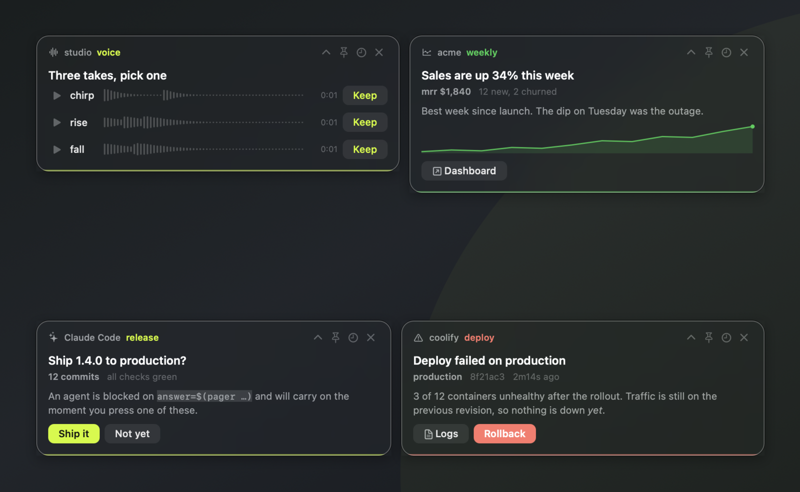

Watch the tour or run `pager --tour` in your terminal and 
https://github.com/user-attachments/assets/1ec86c60-efa7-4878-9779-abc142b9b521


installing. There is also a narrated ninety second walkthrough:
https://github.com/user-attachments/assets/6b28625f-0de6-4b93-b61c-5c8bc92f1ffc


Any program that can run a shell command can use it. That includes cron jobs, git hooks, deploy scripts, local CI, shell traps, and coding agents. There is no service or SDK to integrate. The program is a single Swift source file with no third-party dependencies.

## Install

Clone the repository and run the installer:

```sh
git clone https://github.com/SignedAdam/pager.git
cd pager
./install.sh
```

The installer compiles `src/Pager.swift` and links the result to `~/.local/bin/pager`. If `swiftc` is unavailable, it uses the prebuilt universal binary in `dist/` instead. The prebuilt binary supports both Apple silicon and Intel Macs.

Make sure `~/.local/bin` is on your `PATH`:

```sh
export PATH="$HOME/.local/bin:$PATH"
```

An interactive install starts the walkthrough. Pass `--no-tour` to skip it, or run it whenever you want:

```sh
pager --tour
```

The tour has ten steps and covers the controls, content types, actions, and placement. There is no Homebrew package yet.

To remove the command symlink while keeping your history and settings:

```sh
./install.sh --uninstall
```

## First command

```sh
pager --title "Build finished" \
  --source "tests" \
  --body "All **412 checks** passed in `3m11s`." \
  --sound rise
```

The command stays in the foreground until the panel is dismissed or its timer expires. Add `&` when a script should display the panel and continue immediately:

```sh
pager --title "Backup complete" --chip "18.4 GB" --seconds 30 &
```

Panels disappear after 180 seconds by default. Use `--seconds` to change that, or `--pinned` when the message must remain until someone handles it.

For more commands to adapt:

```sh
pager --examples
```

## Actions and answers

Add a button with `--action "Label:command"`. The option is repeatable. Clicking a button runs its command through `/bin/sh`, prints the button label to `stdout`, and closes the panel.

```sh
pager --title "Deploy failed on production" \
  --app "coolify" \
  --source "deploy" \
  --accent "#ff5f57" \
  --body "3 of 12 containers are unhealthy. Traffic is still on the previous revision." \
  --chip "production" \
  --action "Logs:open https://coolify.example.com/logs" \
  --action "Rollback:./rollback.sh production" \
  --pinned
```

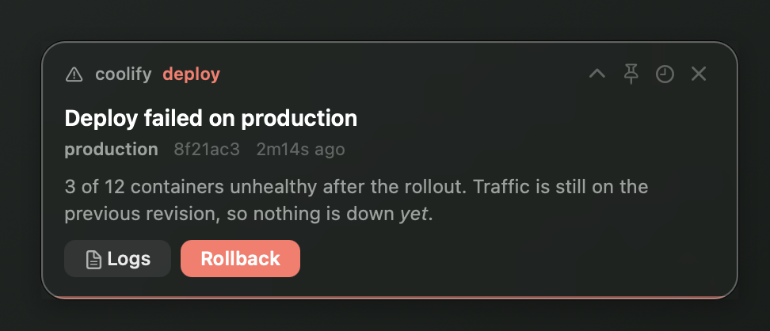

The command part may be empty. That turns `pager` into a question a shell script or agent can wait on:

```sh
answer="$(pager \
  --title "Ship 1.4.0 to production?" \
  --app "Claude Code" \
  --source "release" \
  --body "12 commits. All checks are green." \
  --action "Ship it:" \
  --action "Not yet:" \
  --pinned)"

case "$answer" in
  "Ship it") ./deploy.sh ;;
  "Not yet"|"") exit 0 ;;
esac
```

The caller waits while the panel is open. It receives `Ship it`, `Not yet`, or an empty string if the panel is dismissed without a choice.

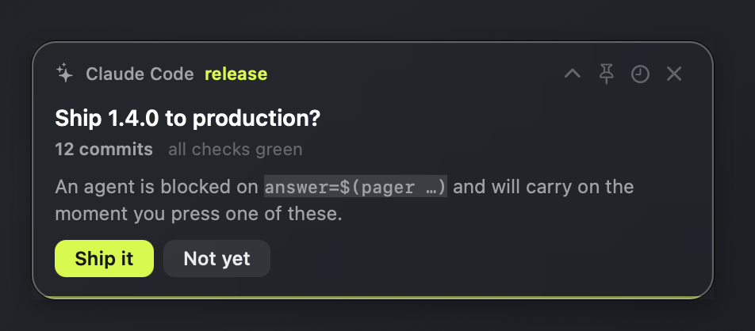

Buttons can have an SF Symbol or image, their own fill color, and their own text color. Put `--action-icon`, `--action-fill`, or `--action-text` immediately after the action they should decorate.

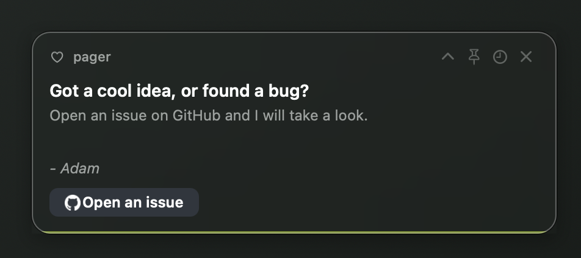

## Text, charts, and media

Titles, body text, and header text accept a small Markdown-style subset:

- `**bold**`
- `*italic*`
- `` `inline code` ``

Escape formatting markers with a backslash:

```sh
pager --title "Files matching \*.log"
```

Use repeated `--chip` options for short captions. Pass a comma-separated list of numbers to `--sparkline` to display an inline chart:

```sh
pager --title "Sales are up 34% this week" \
  --app "acme" \
  --source "weekly" \
  --accent "#28c840" \
  --body "Best week since launch. Tuesday's dip was the outage." \
  --chip "mrr $1,840" \
  --chip "12 new, 2 churned" \
  --sparkline "4,6,5,9,8,12,17,16,22" \
  --action "Dashboard:open https://example.com/admin"
```

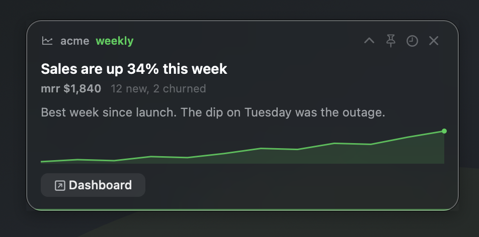

`--image` displays a still image or animated GIF. `--video` embeds an autoplaying video with its own playback controls. Add `--loop` to repeat a video.

```sh
pager --title "New render is ready" \
  --source "render" \
  --video "$HOME/renders/demo.mp4" \
  --action "Open folder:open $HOME/renders"
```

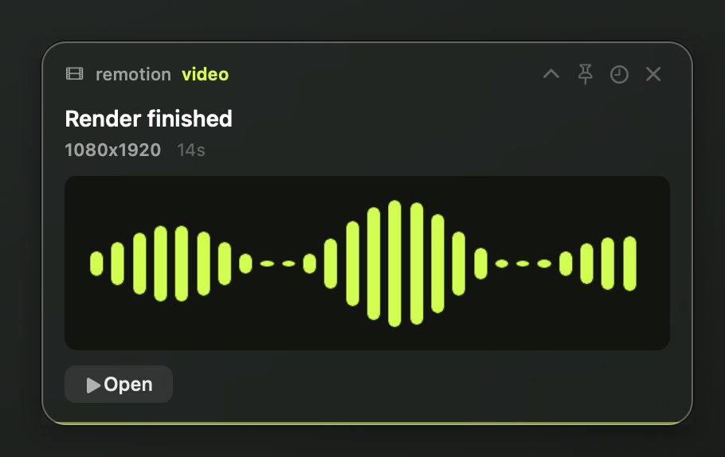

Each audio file displays a play button, duration, and waveform. Click the player to jump to that position in the track. Only one file plays at a time, and the panel timeout pauses during playback.

```sh
pager --title "Three takes, pick one" \
  --app "studio" \
  --source "voice" \
  --width 540 \
  --audio "chirp:$HOME/takes/chirp.wav" \
  --audio "rise:$HOME/takes/rise.wav" \
  --audio "fall:$HOME/takes/fall.wav" \
  --choose "Keep:printf '%s\n' '{}' >> $HOME/takes/kept.txt" \
  --pinned
```

`--choose` adds an action button to every audio row. In the command string, `{}` is replaced by the item name and `{path}` by its file path. Clicking the button runs the command and keeps the panel open.

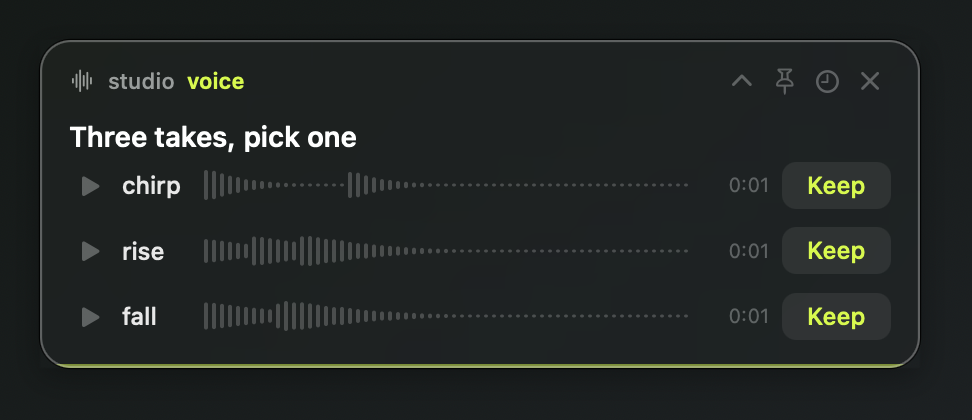

## Window behavior

Panel controls (top right):

- **Collapse**: Minimizes the panel to a single line.
- **Pin**: Keeps the panel open by disabling the timeout.
- **Remind**: Hides the panel and reschedules it for 10m, 30m, 1h, 3h, or 9:00 AM tomorrow.
- **Dismiss**: Closes the panel.

You can also:

- drag the panel anywhere on screen;
- middle-click it to dismiss it;
- right-click it for actions, pinning, compact mode, reminders, copy entries, and dismissal.

The window is a non-activating `NSPanel` at status-bar level, and the process uses macOS's accessory activation policy. It does not enter the Dock, appear in the app switcher, or take keyboard focus from the application where you are typing. It can remain visible across Spaces and beside full-screen applications.

### Placement and stacking

Panels can start in any corner. Each corner keeps its own stack, so unrelated groups do not affect one another.

`vertical` is the default stacking mode. `cascade` fans panels out so their identities remain visible. `none` places a panel without reserving space in a stack.

| Vertical | Cascade |
| --- | --- |
| 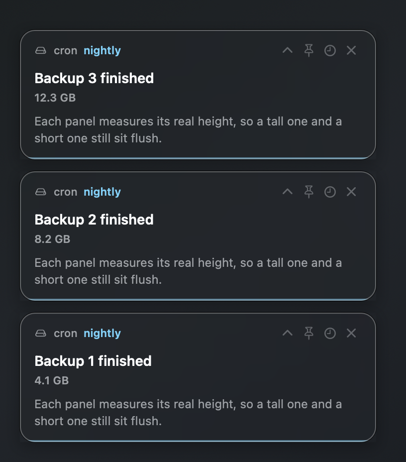 | 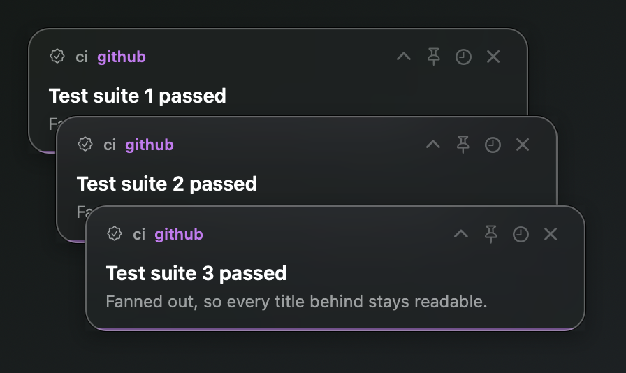 |

When a panel in a vertical stack closes, the panels beyond it slide into the free space.

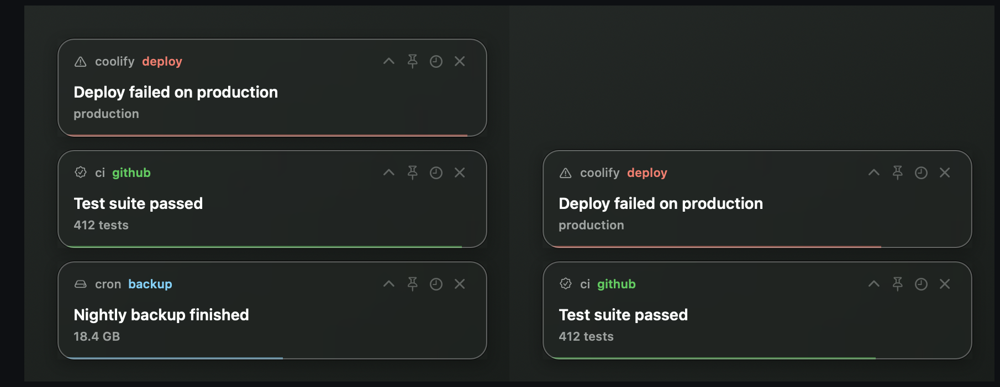

When you drag a panel, it detaches from its stack. Future panels without `--corner` open at this new position. Panels with an explicit `--corner` still use that corner's default position.

## Use from scripts and agents

Run `pager` in the background (with `&`) to display a panel without blocking. Run it in the foreground to wait for user interaction; it prints the clicked button to standard output when closed.

### Shell traps

```sh
#!/bin/bash
set -Eeuo pipefail

trap 'pager --title "backup.sh failed at line $LINENO" \
  --source "backup" --accent "#ff5f57" --sound fall --pinned' ERR

run_backup
```

### Git hooks

```sh
#!/bin/sh

if ! make test; then
  pager --title "Pre-push checks failed" \
    --source "git" \
    --action "Open log:open /tmp/pre-push.log" \
    --pinned &
  exit 1
fi
```

### Cron and local CI

Use an absolute path when the job has a minimal `PATH`:

```cron
0 3 * * * /Users/you/.local/bin/pager --title "Nightly backup finished" --source cron --sound wood
```

Requires an active graphical user session to display panels. It will not work on headless machines or over SSH sessions that do not have access to a logged-in macOS desktop.

### Coding agents

A coding agent that can run shell commands can use the same blocking pattern as a script. Give it a command such as:

```sh
pager --title "The release is ready. Continue?" \
  --app "coding agent" \
  --source "approval" \
  --action "Continue:" \
  --action "Stop:" \
  --pinned
```

Tell the agent to wait for `stdout` and continue only when it reads `Continue`. The panel does not need to know which agent opened it.

## Option reference

`--title` is required for a panel. Options that say repeatable may be supplied more than once.

### Content and appearance

| Option | Meaning |
| --- | --- |
| `--title <text>` | Main text. Required. Supports bold, italic, and inline code markup. |
| `--body <text>` | Wrapped paragraph below the title. Supports the same markup. |
| `--app <name>` | Application or tool name in the header. |
| `--source <name>` | Source or channel in the header, colored with the accent. |
| `--subtitle <text>` | Muted header text beside the source. |
| `--icon <symbol\|path>` | SF Symbol name or an image path for the header. |
| `--chip <text>` | Short caption below the title. Repeatable. |
| `--meta <text>` | Alias for `--chip`. Repeatable. |
| `--sparkline <numbers>` | Line chart from numbers separated by commas, semicolons, or spaces. |
| `--accent "#rrggbb"` | Accent color used for the source, chart, progress line, and selection state. Default: `#c8ff00`. |
| `--width <points>` | Requested panel width. It is scaled for the display and capped to the visible screen. |
| `--compact` | Open in collapsed form. |

### Actions and copying

| Option | Meaning |
| --- | --- |
| `--action "Label:command"` | Add a button. Clicking it prints `Label`, starts `command` through `/bin/sh`, and closes the panel. Repeatable. The command may be empty. |
| `--action-icon <symbol\|path>` | Give the preceding action an SF Symbol or image. |
| `--action-fill "#rrggbb"` | Set the preceding action's background color. |
| `--action-text "#rrggbb"` | Set the preceding action's text color. |
| `--copy "Label:text"` | Add a right-click menu entry that copies `text`. Repeatable. The title is always available separately as Copy title. |

The first colon separates the label from the command or copied value. Later colons are kept, so URLs and other colon-containing values work as expected.

### Images, video, and audio

| Option | Meaning |
| --- | --- |
| `--image <path>` | Display a still image or animated GIF. |
| `--video <path>` | Display and autoplay a local video with inline controls. If both image and video are set, video is used. |
| `--media-height <points>` | Maximum media height. Default: `260`. Aspect ratio is preserved. |
| `--loop` | Restart the video when it reaches the end. |
| `--audio "Name:path"` | Add a playable waveform row. Repeatable. A bundled sound name can be used in place of a path. |
| `--choose "Label:command"` | Add a button to every audio row. `{}` expands to the row name and `{path}` to its resolved file path. The panel stays open after a choice. |

Paths beginning with `~` are expanded. Missing or unreadable media is omitted from the panel.

### Placement and lifetime

| Option | Meaning |
| --- | --- |
| `--corner <name>` | Use `bottom-right`, `bottom-left`, `top-right`, or `top-left`. The initial default is `bottom-right`; dragging can change the remembered default anchor. |
| `--display <n>` | Which monitor to use. The default follows the screen you are working on. Run `pager --screen` to list them. |
| `--stack <mode>` | Use `vertical`, `cascade`, or `none`. Default: `vertical`. |
| `--gap <points>` | Space between vertically stacked panels. Default: `12`. |
| `--offset "dx,dy"` | Move the panel by an additional horizontal and vertical offset from its anchor. |
| `--seconds <n>` | Seconds before automatic dismissal. Default: `180`. |
| `--pinned` | Open without an expiry timer. |
| `--sound <name\|path>` | Play a bundled sound or a WAV file. Use `none` for silence. Silence is the default. |

### Utility commands

Run each utility as shown:

| Command | Meaning |
| --- | --- |
| `pager --help` | Print the short usage summary. |
| `pager --tour` | Run the ten-step interactive walkthrough. |
| `pager --examples` | Print commands ready to copy and adapt. |
| `pager --sounds` | Play all bundled sounds in sequence. |
| `pager --version`, `pager -v` | Print the version. |
| `pager --screen` | Print the main screen's visible bounds, full bounds, primary-screen size, and screen count for placement scripts. |

Set `PAGER_DEBUG=1` to print stacking diagnostics to standard error.

## Sounds

The bundled sounds are `chirp`, `tick`, `drop`, `thump`, `wood`, `glass`, `rise`, `fall`, `bell`, and `alarm`. Sounds are off by default. Preview the bundled sounds with:

```sh
pager --sounds
```

You can also pass a WAV file to `--sound`. To replace a bundled sound locally without modifying the checkout, put a file with the same name at `~/.pager/sounds/<name>.wav`.

## The log

Every panel writes a small stream of events to `~/.pager/log.jsonl`: what was
shown, which command asked for it, and how it ended. One JSON object per line.

### As a window

```sh
pager log --window
pager log --window --grep deploy    # open it already filtered
```

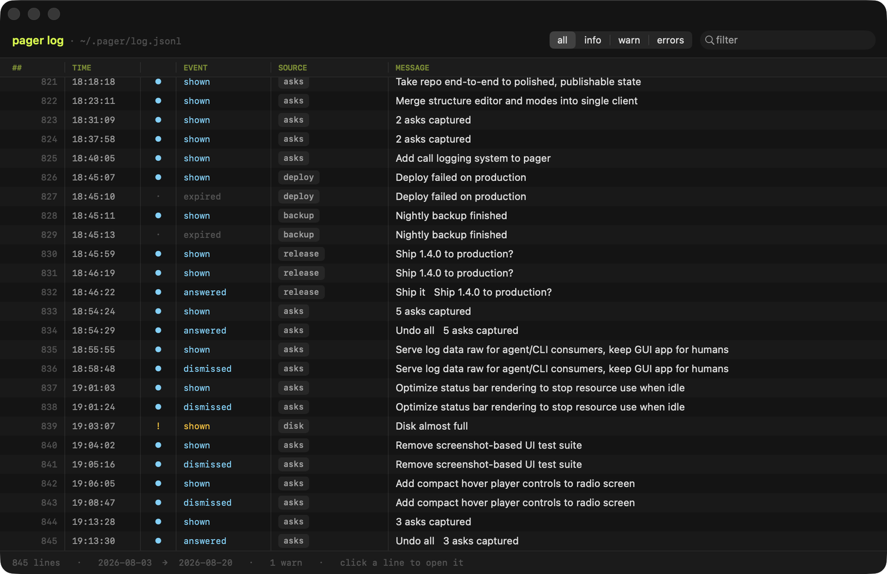

The log viewer groups events by date and streams new entries as they arrive.
Click any row to expand its full record, including the command that created it.
Use the controls at the top to filter by log level or search by text.

### As data

Piping gives you the lines exactly as they were written:

```sh
pager log | jq 'select(.event == "answered")'
pager log --caller cron --json
```

In a terminal the same command prints a readable version instead. `--json`
forces the raw form and `--pretty` forces the readable one.

```sh
pager log --source deploy    # one source
pager log --errors           # only what went wrong
pager log --follow           # keep printing as they arrive
pager log --stats            # who calls pager, and how panels end
```

Events are `shown`, `answered`, `chose`, `dismissed`, `snoozed` and `expired`.
`--stats` reports what is paging you most and what share of panels are
answered.

The file rolls over to `log.jsonl.1` past four megabytes.

## Security

Commands supplied through `--action` and `--choose` are passed to `/bin/sh -c`. Treat them exactly like shell code. Never interpolate filenames, messages, branch names, clipboard contents, model output, or any other untrusted text into an action command. Pass fixed commands or validate and quote every value before constructing the option.

## Build and contribute

The implementation lives in [`src/Pager.swift`](src/Pager.swift). The shell examples are in [`examples/`](examples/), and screenshots are under [`docs/`](docs/).

Useful development commands:

```sh
make             # list available targets
make build       # compile bin/pager
make check       # check Swift and shell syntax
make test        # exercise the walkthrough with a stub pager
make demo        # display a panel with representative content
make shots       # regenerate docs screenshots
make tarball     # build a self-contained archive
```

See [CONTRIBUTING.md](CONTRIBUTING.md) for code organization and rules. Open an issue or pull request at
[github.com/SignedAdam/pager](https://github.com/SignedAdam/pager); there are
[templates](.github/ISSUE_TEMPLATE) for a bug and for an idea.

## License

[MIT](LICENSE), copyright 2026 Adam Albastov.
